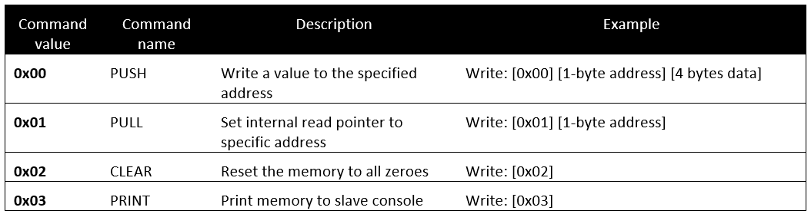

# mBed I2C Memory

This small I2C Memory Slave emulates a really small I2C memory device. It allows you to store 64 integers (of 4 bytes) each and retrieve them.

To connect to the device you will need to attach an I2C master device to pin 27 (SCL) and pin 28 (SDA).

To get some console output from the slave device you can use a terminal program such as Putty to connect to the serial interface over USB at a speed of 115200 baud.

The slave device also has an alive LED which will blink periodically (about 500ms interval) as long as the device is operational and responsive.

The I2C bus operates at 400kHz and the slave device address is 0x28 (8-bit).

The following overview shows the commands that can be send to the slave device.

With the **PUSH** command you can write a value to the memory device. All you need to do is send 6 bytes to the device. The command byte, followed by the address of where the value should be stored and last the actual integer value consisting of 4 bytes.

The **PULL** command allows you to set the internal read pointer of the slave. This pointer is used when reading from the device and should point to the memory location you want to read. Once set you can do a read from the slave device, which will send you 5 bytes. The first byte is the address of the internal read pointer. The following 4 bytes are the actual value stored in the memory at the given address.

The **CLEAR** and **PRINT** commands are simple 1-byte commands which can be send to the device to respectively clear the memory and to print the content of the memory to the slave's console (serial interface).